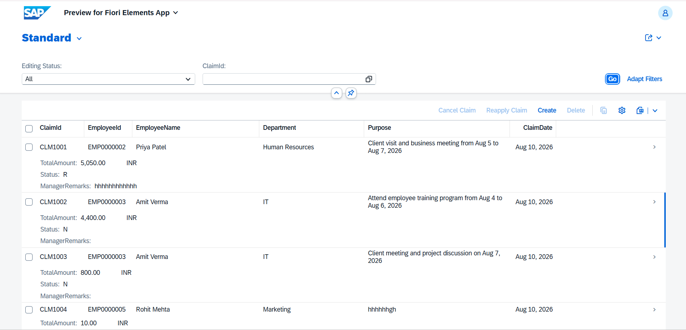
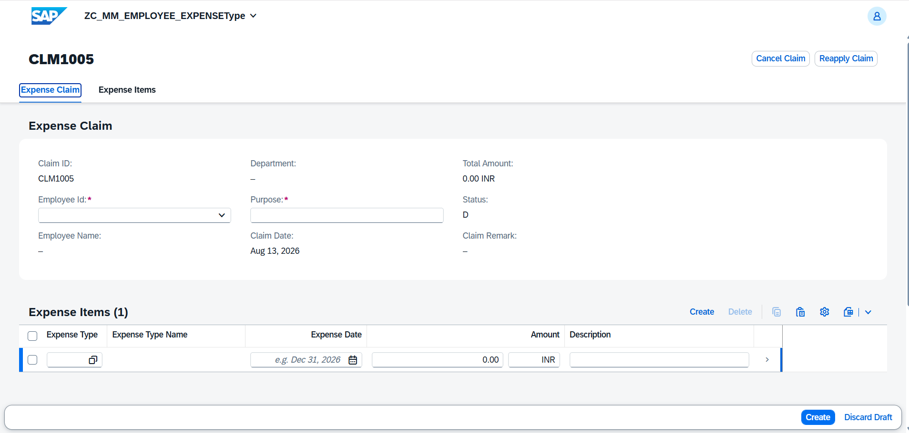
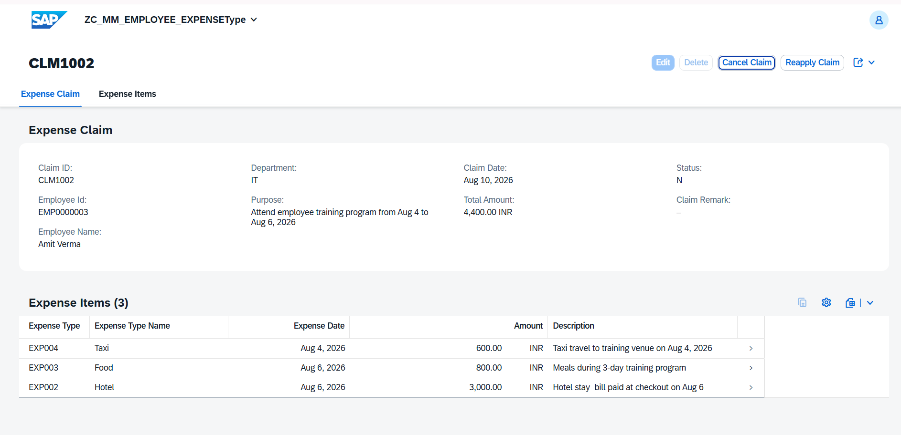
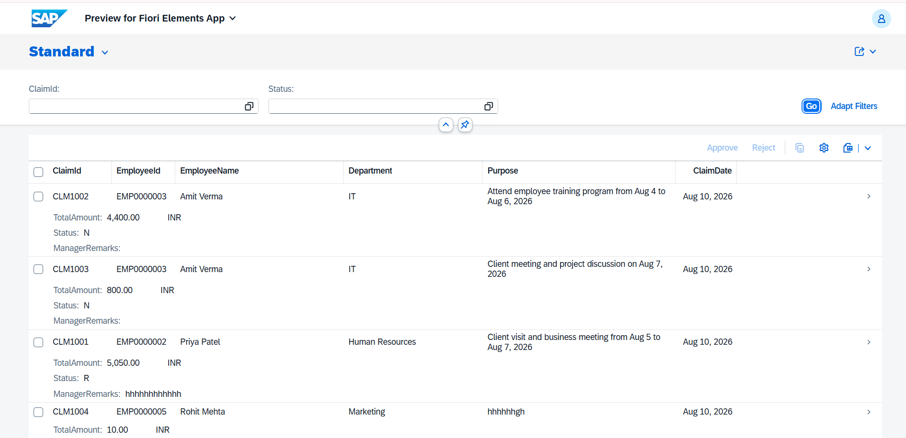
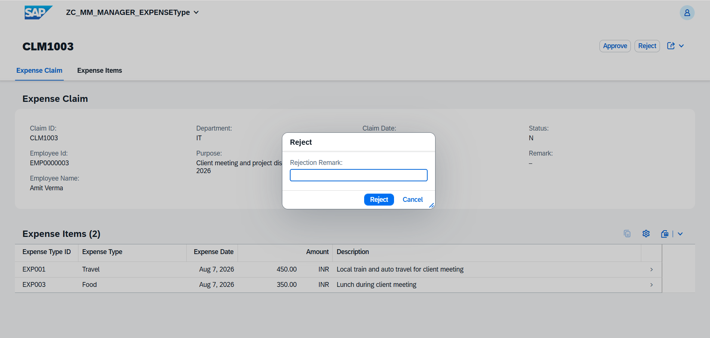
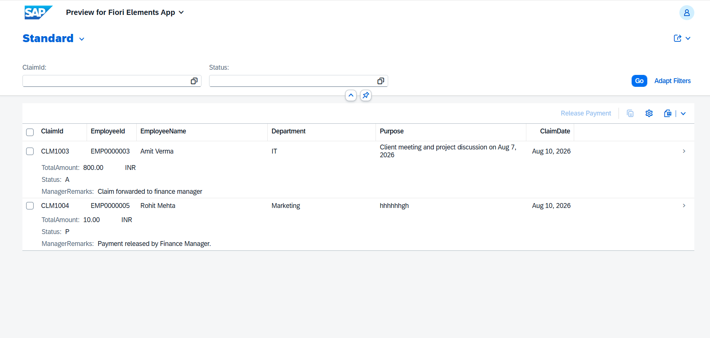

# 💼 Employee Expense Reimbursement System

**SAP ABAP RAP + CDS + SAP Fiori Elements**

An end-to-end employee expense reimbursement application developed using **SAP ABAP RESTful Application Programming Model (RAP)** and **SAP Fiori Elements**.

The system manages the complete expense process across three role-based applications:

**Employee → Manager → Finance**

All three applications are built around the same core **Expense Claim** and **Expense Item** business entities, with separate projection views for each role.

---

## 🚀 Features

### 👨‍💼 Employee

* Create expense claims
* Add multiple expense items to a claim
* View claim details and status
* Cancel eligible claims

### 👨‍💼 Manager

* View submitted expense claims
* Review expense items
* Approve claims
* Reject claims

### 💰 Finance

* View **only Manager-approved claims**
* Review approved claims and expense items
* Process reimbursement
* Track processed claims

---

## 🔄 Workflow

```text
Employee
   ↓
Expense Claim
   └── Expense Items
   ↓
Submit Claim
   ↓
Manager Review
   ├── Reject
   └── Approve
          ↓
   Finance sees approved claim
          ↓
   Process Reimbursement
```

---

## 🏗️ Core Business Model

```text
             Expense Claim
                   │
                   │ 1 : N
                   ▼
              Expense Item
```

The **Expense Claim** is the main business entity, while **Expense Items** contain the individual expenses belonging to the claim.

The same Claim and Item data is used across all three applications through role-specific projection views:

```text
                  Expense Claim
                       │
                  Expense Item
                       │
          ┌────────────┼────────────┐
          ↓            ↓            ↓
      Employee       Manager      Finance
        App            App           App
```

---

## 📱 Fiori Applications

| Application              | Purpose                           |
| ------------------------ | --------------------------------- |
| **Employee Expense App** | Create and manage expense claims  |
| **Manager Expense App**  | Review, approve and reject claims |
| **Finance Expense App**  | Process Manager-approved claims   |

Each application uses a **role-specific projection view** while working with the common Expense Claim and Expense Item business model.

---

## 🏗️ SAP RAP Implementation

The project includes:

* CDS View Entities
* Root & Child Entities
* Composition & Associations
* Projection Views
* Behavior Definitions
* Behavior Implementation Classes
* RAP Actions
* Validations
* Instance Feature Control
* Side Effects
* Draft Handling
* Value Helps
* Metadata Extensions
* OData Service
* Service Definition & Binding

---

## 🗄️ Main Database Tables

```text
ZMM_EMPLOYEE
ZMM_EXPENS_CLAIM
ZMM_EXPENSE_ITEM
ZMM_EXPENSE_TYPE
```

Draft tables are also used for RAP draft processing.


---

## 🛠️ Technology Stack

* **SAP S/4HANA**
* **ABAP**
* **ABAP RAP**
* **CDS**
* **OData V4**
* **SAP Fiori Elements**
* **SAPUI5**
* **SAP HANA**
* **Eclipse ADT**

---

## 📸 Applications

### 👨‍💼 Employee Application







### 👨‍💼 Manager Application





### 💰 Finance Application



---

## 👨‍💻 Author

**Meet Mokal**

SAP ABAP | RAP | CDS | Fiori Elements
